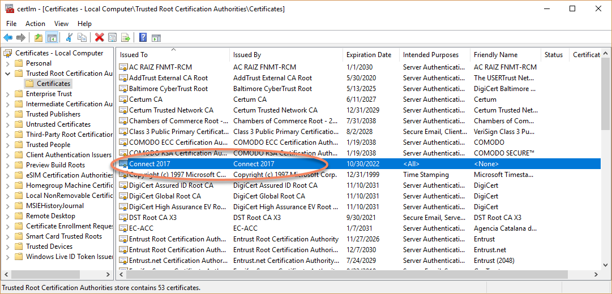

# Enabling Azure AD B2C logins

The web can use AD B2C for the login process. The external provider configured is "Live ID", so if you enable AD B2C logins, you will be able to login with any Live ID Account.

The 1st step to enable AD B2C is **to remove the `FakeAuth` section in the `appsettings.Development.json`**. Then you can run the web and should be able to login to use AD B2C. **Please do not change the port used**: The web must run under `http://localhost:57458`, because this is the redirect url configured in B2C.

## Deploying the web in Azure

To deploy the web in Azure you can use the _Publish_ button from VS2017 to deploy to a new or existing Azure App Service. You can override the values in `appsettings.Development.json` file with AppSettings.

If you deploy the public web in your own App Service be sure to activate the `FakeAuth` because you won't be able to use Azure B2C to login (the redirect url of your own app service won't be in B2C):

## Running the public web site

There are **two versions of the public web site**.

* `http://smarthotel360public.azurewebsites.net/` which has FakeAuth enabled **and MUST be accessed using http (NOT https)**
* `https://smarthotel360public-b2c.azurewebsites.net/` which has FakeAuth disabled (thus uses B2C) **and MUST be accessed using https (NOT plain http)**

> We recommend to use the first one, use the second one only if you want to test the B2C

B2C forces the web to use https (which is **NOT** bad), but if you access the web using https, ajax calls to backend services must be performed using https (to avoid broswer security errors). Public backend is located in a Kubernetes cluster running at _sh360services-public.eastus2.cloudapp.azure.com_. This cluster is configured to accept both HTTP and HTTPS connections, but **SSL certificate used is not emited from one custom CA**. That means that if you try to access the public backend API you'll receive an error (INVALID_CERT) because SSL certificate is not recognized from your browser (the CA is not recognized).

If you want to use the public web site under https (to use B2C) you **must install the CA Root certificate** in your computer. Once certificate is installed, your browser will trust the CA, so it will trust the certificate and the HTTPS connections could be used. To trust the CA just run open a command prompt with administrative rights, go to `/cert-ca` folder and tun the `install_ca.cmd` file. Then restart your browser.

To check the CA certificate is installed open "certificate managmer" (certmgr.exe) and look for the "Connect 2017" certificate under "Local Computer -> Trusted Root Certificate Authorities -> Certificates".

